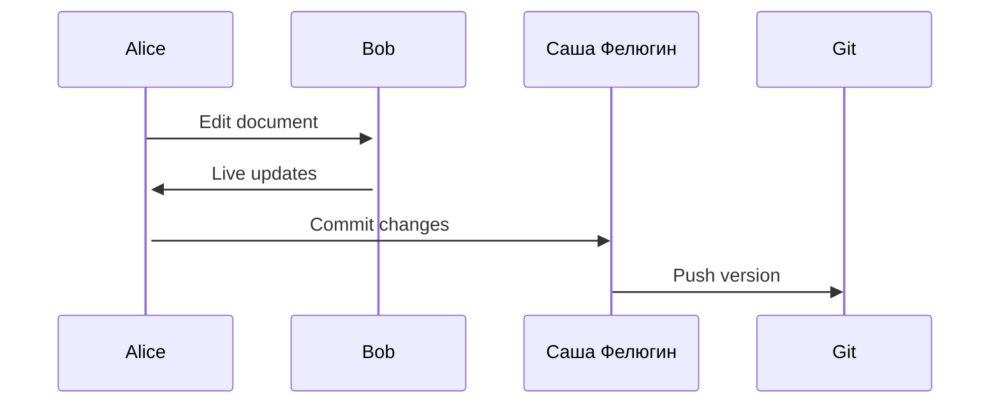

## Overview

Саша Фелюгин provides powerful tools to create, collaborate, and publish high-quality documentation. You can build rich MDX pages with components, organize content hierarchically, and customize your docs site to match your brand.

<Columns cols={3}>
  <Card title="Document Creation" icon="edit-3" href="#document-creation">
    Intuitive editing with live preview and MDX support.
  </Card>
  <Card title="Collaboration" icon="users" href="#collaboration">
    Real-time editing, version history, and team workflows.
  </Card>
  <Card title="Search & Organization" icon="search" href="#search">
    Full-text search and flexible content structuring.
  </Card>
</Columns>

<Columns cols={2}>
  <Card title="Customization" icon="palette" href="#customization">
    Themes, components, and layout options.
  </Card>
  <Card title="Export & Sharing" icon="share-2" href="#export">
    Multiple formats and embed options.
  </Card>
</Columns>

## Document Creation and Editing Tools

Create and edit documents with an intuitive interface supporting Markdown and MDX. Use the live preview to see changes instantly, and insert components like `<Callout>` or `<Steps>` directly.

<Tabs>
  <Tab title="Markdown Editor" icon="edit">
    Write standard Markdown with auto-completion for headings, lists, and code blocks.
  </Tab>
  <Tab title="MDX Components" icon="code">
    Drag-and-drop components for richer content. For example, add a `<CodeGroup>` for multi-language examples.
  </Tab>
</Tabs>

<Callout kind="tip">
  Enable rich text mode for non-technical users to format content without syntax knowledge.
</Callout>

## Collaboration and Version Control

Work with your team in real-time. Саша Фелюгин tracks changes, supports branching, and integrates with Git for version control.



<Steps>
  <Step title="Invite Collaborators" icon="user-plus">
    Share your workspace link and set permissions.
  </Step>
  <Step title="Review Changes" icon="git-branch">
    Use the diff viewer to approve edits.
  </Step>
  <Step title="Merge & Publish" icon="git-merge">
    Resolve conflicts and deploy updates.
  </Step>
</Steps>

## Search and Organization Features

Organize your docs with nested pages, tags, and table of contents. Full-text search indexes all content for quick discovery.

| Feature | Description | Use Case |
|---------|-------------|----------|
| Hierarchical Pages | Nest docs up to 5 levels deep | Product guides |
| Tags & Categories | Label pages for filtering | API references |
| Global Search | Fuzzy matching across all docs | Troubleshooting |

## Customization Options

Tailor your docs site with themes and custom components. Override styles using CSS variables like `--brand-color: #3B82F6`.

<CodeGroup tabs="CSS,JSON">
  ```css
  :root {
    --brand-color: #3B82F6;
  }
  ```
  ```json
  {
    "theme": "custom",
    "primaryColor": "#3B82F6",
    "components": ["Callout", "Steps"]
  }
  ```
</CodeGroup>

<Expandable title="Advanced Theming" default-open="false">
  Import custom fonts and icons. Extend MDX with your own React components.
</Expandable>

## Export and Sharing Functionalities

Publish your docs as a static site, PDF, or embeddable widgets. Share individual pages via public links.

<Callout kind="success">
  Static exports are optimized for CDNs, ensuring `<100ms` load times globally.
</Callout>

Export workflows:

1. Select format (HTML, PDF, ZIP).
2. Configure options like branding.
3. Download or deploy to hosting.

These features make Саша Фелюгин your complete documentation solution. Start by [creating your first page](/introduction#quick-start).