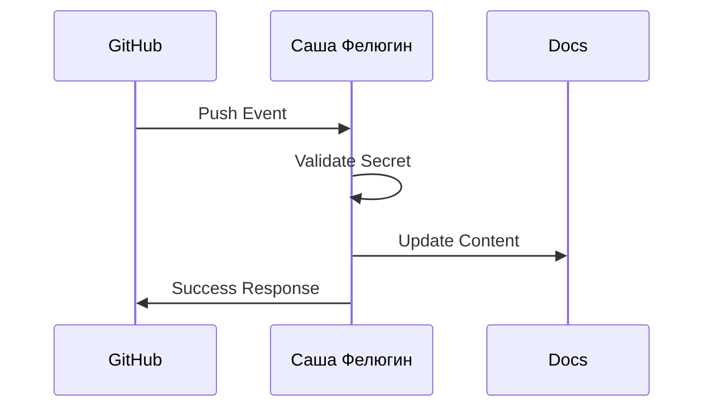

## Overview

Саша Фелюгин supports seamless integrations with popular tools to automate your documentation workflows. Connect your GitHub repositories for automatic syncing, set up webhooks for real-time updates, or embed external content directly into your docs. Use the API for custom solutions or link with Slack and Jira for notifications and issue tracking.

<Columns cols={3}>
  <Card title="GitHub" icon="github" href="#github-integration">
    Sync repositories and automate deployments.
  </Card>
  <Card title="Slack" icon="message-circle" href="#slack-integration">
    Get instant notifications on doc updates.
  </Card>
  <Card title="Jira" icon="file-text" href="#jira-integration">
    Link docs to issues for better project tracking.
  </Card>
</Columns>

## GitHub Integration

Connect your GitHub repository to automatically publish documentation changes. This keeps your docs in sync with your codebase.

<Steps>
  <Step title="Create Webhook" icon="hook">
    In your GitHub repo settings, navigate to Webhooks and click "Add webhook".
  </Step>
  <Step title="Configure Payload" icon="settings">
    Set the Payload URL to `{https://api.example.com/webhooks/github}` and Content type to `application/json`.
  </Step>
  <Step title="Add Secret" icon="lock">
    Generate a secret and add it as `GITHUB_SECRET` in your Саша Фелюгин dashboard.
  </Step>
</Steps>



<Callout kind="tip">
Test the webhook with a sample push to ensure events trigger doc rebuilds correctly.
</Callout>

## Webhook Setups

Use webhooks to receive real-time notifications from Саша Фелюгин. Configure them for events like doc publishes or version updates.

<CodeGroup tabs="cURL,JavaScript">
````bash
curl -X POST https://your-webhook-url.com/webhook \
  -H "Content-Type: application/json" \
  -d '{
    "event": "doc.updated",
    "docs_id": "your-docs-id"
  }'
````

````javascript
const response = await fetch('https://your-webhook-url.com/webhook', {
  method: 'POST',
  headers: { 'Content-Type': 'application/json' },
  body: JSON.stringify({
    event: 'doc.updated',
    docs_id: 'your-docs-id'
  })
});
````
</CodeGroup>

<ParamField path="docs_id" param-type="string" required="true">
  Unique identifier for your documentation space.
</ParamField>

<ParamField header="X-Signature" param-type="string" required="true">
  HMAC signature for payload verification using your secret.
</ParamField>

## API Access for Custom Integrations

Build custom tools using the Саша Фелюгин API. Authenticate with your API key.

<Request tabs="JavaScript,cURL">
````javascript
const response = await fetch('https://api.example.com/v1/docs', {
  method: 'GET',
  headers: {
    'Authorization': `Bearer ${YOUR_API_KEY}`
  }
});
````

````bash
curl -X GET https://api.example.com/v1/docs \
  -H "Authorization: Bearer YOUR_API_KEY"
````
</Request>

<Response tabs="200">
```json
{
  "docs": [
    {
      "id": "doc-123",
      "title": "Introduction",
      "updated_at": "2024-10-15T10:00:00Z"
    }
  ]
}
```
</Response>

## Popular Tool Connections

<Tabs>
  <Tab title="Slack" icon="message-circle">
    Send notifications to a Slack channel on doc changes.

    <CodeGroup tabs="Node.js,Python">
````javascript
const slack = require('slack-notify')(process.env.SLACK_WEBHOOK);
slack.alert({
  text: 'Docs updated!',
  channel: '#docs'
});
````

````python
import requests
requests.post('https://hooks.slack.com/services/YOUR/SLACK/WEBHOOK', json={
    'text': 'Docs updated!'
})
````
    </CodeGroup>
  </Tab>
  <Tab title="Jira" icon="file-text">
    Create Jira issues from doc comments.

    <Expandable title="Advanced Jira Config">
      Set `JIRA_API_URL` and `JIRA_TOKEN` in your environment.
    </Expandable>
  </Tab>
</Tabs>

## Embedding External Content

Embed iframes or dynamic content from third-party sources.

```html
<iframe src="https://your-embed-url.com" width="100%" height="400"></iframe>
```

<Callout kind="alert">
Ensure embedded content complies with your site's security policies, such as CSP headers.
</Callout>

Review these integrations in your dashboard at `{https://dashboard.example.com/integrations}` to monitor activity and performance.